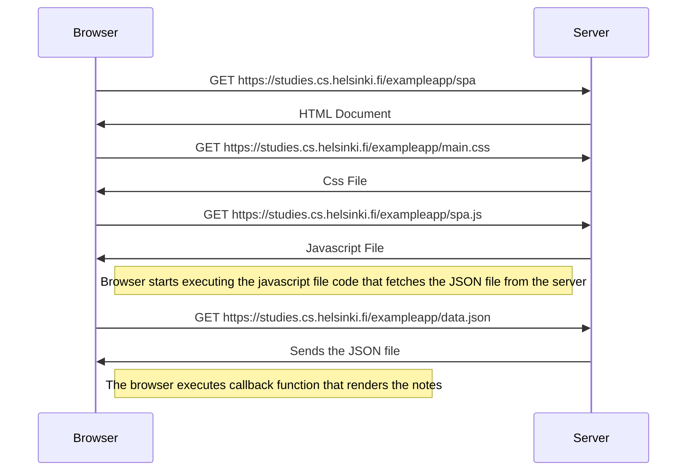

```mermaid
sequenceDiagram
    participant Browser
    participant Server

    Browser->>Server: GET https://studies.cs.helsinki.fi/exampleapp/spa
    Server->>Browser: HTML Document

    Browser->>Server: GET https://studies.cs.helsinki.fi/exampleapp/main.css
    Server->>Browser: Css File

    Browser->>Server: GET https://studies.cs.helsinki.fi/exampleapp/spa.js
    Server->>Browser: Javascript File

    Note right of Browser: Browser starts executing the javascript file code that fetches the JSON file from the server

    Browser->>Server: GET https://studies.cs.helsinki.fi/exampleapp/data.json
    Server->>Browser: Sends the JSON file 

    Note right of Browser: The browser executes callback function that renders the notes 


```