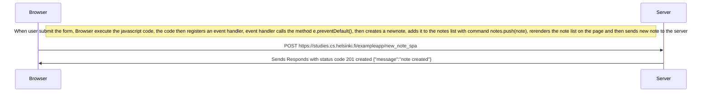

```mermaid
sequenceDiagram
    participant Browser
    participant Server

    Note right of Browser: When user submit the form, Browser execute the javascript code, the code then registers an event handler, event handler calls the method e.preventDefault(), then creates a newnote, adds it to the notes list with command notes.push(note), rerenders the note list on the page and then sends new note to the server

    Browser->>Server: POST https://studies.cs.helsinki.fi/exampleapp/new_note_spa
    Server->>Browser: Sends Responds with status code 201 created {"message":"note created"}

```